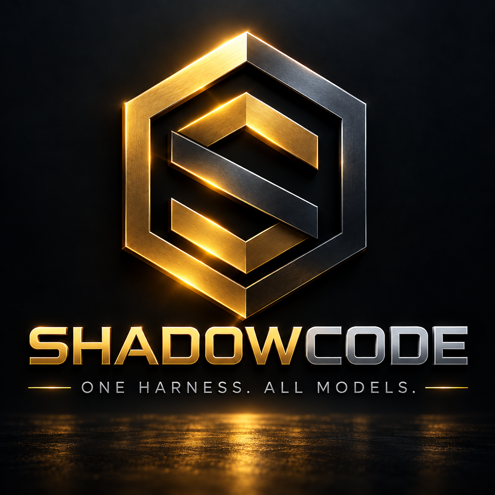
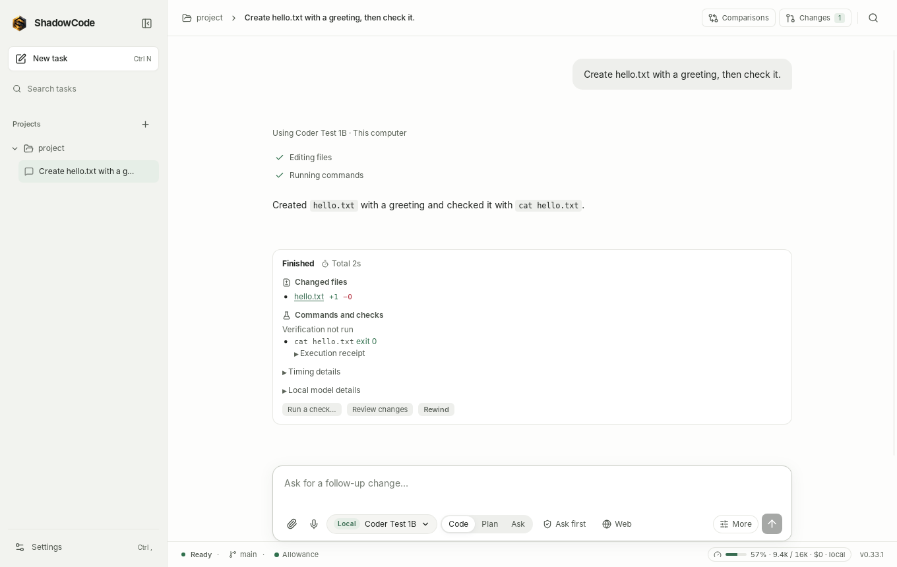
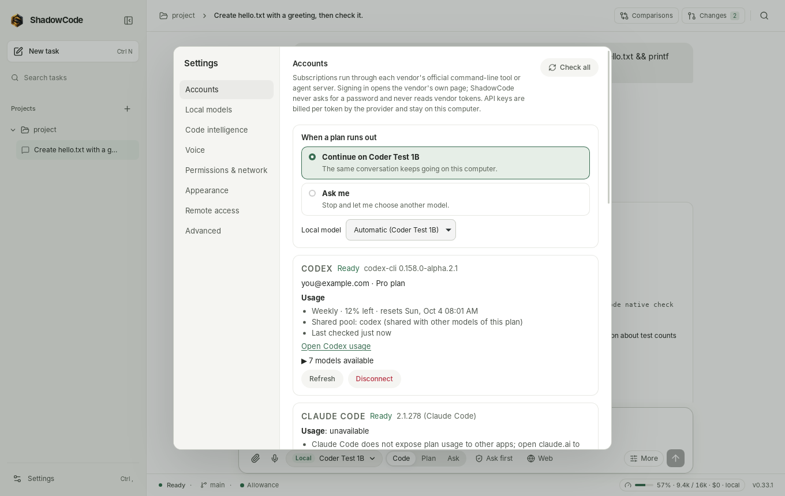

# ShadowCode

<p align="center">
  
</p>

ShadowCode is a Linux desktop coding agent. Open a project, pick a model,
describe the change, watch the agent work, then review the diff.

The model can come from a subscription you already have (Codex, Claude Code,
Cursor, Antigravity or Grok, driven through each vendor's own command-line
tool), from an [OpenRouter](https://openrouter.ai) API key if you have no
subscription (hundreds of models, billed per token), or from a model that
runs on your computer through a llama.cpp runtime that ships with the app.
With no account at all, ShadowCode offers a free model to download that fits
your computer. You don't need Ollama, LM Studio or any other model server.



- **One picker.** The composer lists **Subscriptions** (or **Vendor CLIs** when billing is unconfirmed), **On this computer**
  and **API keys** in one menu. Each row shows whether it is ready, whether it
  runs locally or in the cloud, and the usage figures the vendor reports.
- **Usage figures come from the vendor.** If a vendor exposes no usage, the row
  says *Usage unavailable* and gives the reason. ShadowCode never makes up a
  figure.
- **Local models run on your hardware.** A bundled, pinned llama.cpp runs on
  Vulkan GPUs or the CPU. A short list of free, Apache-2.0 models (Granite,
  Gemma 4, gpt-oss, Qwen3.6) downloads on request, with a recommendation for
  your memory and graphics card. Models already in an Ollama store can be
  imported by reference without copying.
- **You approve actions.** Choose *Ask before actions* or *Allow project edits*.
  Approval cards show the actual diff or command. After a task you review
  just what it changed, keep or undo each change, and rewind shell commands
  and subscription edits too.
- **Explicit execution boundaries.** ShadowCode's native agent uses the
  configured command sandbox. Vendor agents and your own terminal follow
  their own execution rules; their tools do not inherit that sandbox.
- **A capable agent.** Subagents, language-server error checking after each
  edit, a repo map and code search, and support for `CLAUDE.md`, Cursor rules
  and Claude Code skills.
- **Edit and verify.** The editor highlights code and preserves drafts; attached
  context shows bounded content and estimates. **Run a check…** starts an explicit
  command from a completed task without another model turn, keeping your draft.
- **Everything in one window.** Run tasks side by side in worktrees, use your
  own terminal, go from commit to pull request, preview the app you're
  building, dictate with your voice, and follow along from your phone.

ShadowCode **0.34.1** is available in [GitHub releases](https://github.com/Shadowfetchapps/ShadowCode/releases/tag/v0.34.1).
See the [0.34.1 release notes](docs/RELEASE_NOTES.md) for changes and qualification
limits, and the [release history](CHANGELOG.md).

## Install

Releases target x86_64 Linux with glibc 2.39 or newer (Ubuntu 24.04 or later).
Check [GitHub releases](https://github.com/Shadowfetchapps/ShadowCode/releases)
for published versions. The 0.34.1 packages and checksums are:

- `ShadowCode_0.34.1_amd64.AppImage`
- `ShadowCode_0.34.1_amd64.deb`
- `SHA256SUMS`, `RELEASE-MANIFEST.json`, `RELEASE-AUTH` and
  `RELEASE-AUTH.sig` (download these beside the package; the installer checks
  the publisher's signature before running anything)

### AppImage (recommended)

The installer requires signed release packages. Published 0.32.0
assets are checksum-only and cannot be installed by this new entry point; use
the instructions shipped with that released version for those existing assets.
The 0.33.0 release attempt failed before signing and publication. Its tag stays
unchanged. Version 0.33.1 was the first signed release; the public trust policy
in `release/trust` now authorizes 0.33.0 through 0.34.1.
For development, use [Build from source](#build-from-source).

Obtain an independently authenticated installer bundle as described below,
then put the signed release AppImage, `SHA256SUMS`, `RELEASE-MANIFEST.json`,
`RELEASE-AUTH` and `RELEASE-AUTH.sig` in one folder. Run the installer from the
reviewed bundle, which supplies its own verifier, public keys and installation
policy. Never obtain those trusted keys from the candidate download itself.
See [publisher authentication](docs/RELEASE_AUTHENTICATION.md) for the exact
bundle and bootstrap requirements.

From that independently authenticated installer bundle, run:

```bash
bash /path/to/trusted-bundle/scripts/install-appimage.sh /path/to/downloads/ShadowCode_0.34.1_amd64.AppImage
```

The installer takes the AppImage path (or `--recover`), resolves its own trusted
policy and keys, and verifies the adjacent release metadata. Verifier flags such
as `--trust-dir` are not installer options.

[`scripts/install-appimage.sh`](scripts/install-appimage.sh):

- verifies the publisher signature, release identity and exact private AppImage
  snapshot before executing it. Checksum-only packages, checksum overrides and
  `--unverified` are refused; the flag is not a signature bypass.
- records the highest authenticated release durably and refuses downgrades or
  changed bytes under the same version. Restoring an older working app after
  failure does not lower this record.
- starts the new AppImage (`--version`) before replacing anything.
- extracts the bundled llama.cpp runtime (`usr/lib/shadowcode`) and checks it:
  no absolute or dangling symlinks, `COMMIT`, `architectures.txt` and `NOTICES`
  present, and `llama-server --version` reports the pinned commit.
- swaps the runtime into `~/.local/lib/shadowcode` with a rename. The old runtime
  is kept as `~/.local/lib/shadowcode.previous` until the install succeeds and is
  put back if a later step fails.
- installs the AppImage as `~/Applications/ShadowCode.AppImage`, the `shadow`
  and `shadowcode` launchers in `~/.local/bin`, and the desktop entry.
- leaves settings, history and project data alone. It removes older ShadowCode
  AppImages only after a successful install.
- records interrupted replacement before activation and restores the prior
  AppImage/runtime on retry when all recorded identities still match. Run
  `./ShadowCode/scripts/install-appimage.sh --recover` to attempt that recovery
  without the original download, using the same trusted installer bundle. Changed, ambiguous or activation-stage states
  are preserved for manual recovery; first-window and database rollback are
  not yet qualified.

After obtaining and verifying the intended package, run the AppImage without installing it:
`./ShadowCode_0.34.1_amd64.AppImage --appimage-extract-and-run`. FUSE is not
required.

### Debian package

Verify the Debian artifact using the independently trusted verifier bundle.
`verified-deb-0.34.1` must not already exist; install the verified snapshot:

```bash
bash /path/to/trusted-bundle/scripts/verify-native-release.sh \
  --bundle-dir /path/to/downloads \
  --trust-dir /path/to/trusted-bundle/release/trust \
  --artifact ShadowCode_0.34.1_amd64.deb \
  --stage-dir ./verified-deb-0.34.1 \
  --expect-version 0.34.1
sudo apt install ./verified-deb-0.34.1/ShadowCode_0.34.1_amd64.deb
```

This manual Debian verification does not provide the AppImage installer's durable
accepted-version and rollback state. Checksums alone do not authenticate a publisher.

The deb installs `shadowcode` and the same llama.cpp runtime in
`/usr/lib/shadowcode`, with a manual page (`man shadowcode`) and bash, zsh and
fish completions. It depends on `git`, `libgomp1`, `libssl3`, `libasound2`,
WebKitGTK and `libc6 (>= 2.39)`, and recommends `libvulkan1`, which is needed
for GPU inference, and `bubblewrap`, which the shell sandbox uses. Removing or
purging it leaves your settings and history in place.
For the AppImage, `shadowcode completions bash|zsh|fish` prints the
completion script.

Distributions and administrators: see [Distributing ShadowCode](docs/DISTRIBUTING.md)
for verification, dependencies, default settings and the update-check switch.

### Updates

At most once a day, and when you press **Check now** in **Settings ›
About**, ShadowCode asks GitHub for the latest release. The request carries
no version or identifier, and nothing is downloaded or installed for you.
When a newer version exists, **Update available** appears in the status bar;
**Settings › About** links the release notes and shows how to update this
installation (the authenticated installer for the AppImage, your package
manager for the deb). Turn it off there with **Check for updates once a
day**; Offline mode pauses it. Distributions can turn it off for everyone.

## First run

1. Choose a project folder. The first time, you are asked to trust it, because
   project instructions, hooks and plugins can influence or run work.
2. Choose a permission mode. *Ask before actions* is the default for new
   installs.
3. If no model is ready (no subscription signed in, no OpenRouter key, no
   local model), choose how ShadowCode should think: **Download a free model
   to run on this computer** (recommended for your hardware and preselected;
   size and time are shown, and nothing downloads until you press Download),
   **Use an OpenRouter key**, or **Sign in to a subscription**. A downloaded
   model is selected as soon as it is ready.
4. Open the picker with `Ctrl+M` or the model button in the composer. Rows that
   aren't ready yet point you to **Settings › Accounts** (sign in) or
   **Settings › Local models** (download a free model or add a GGUF).

## The picker


The picker groups vendor routes under **Subscriptions** or **Vendor CLIs**, alongside **On this computer** and **API
keys** (OpenRouter, clearly marked as billed per token). Every row is a
concrete target with a stable ID, for example `cli:cursor:auto`,
`local:gguf:<hash>` or `api:openrouter:qwen/qwen3-coder`. Selecting it applies to the current
conversation, and ShadowCode remembers the choice per conversation. Rows
show:

- **Local** or **Cloud**.
- **Availability**: *Ready*, *Sign in*, *Setup required* or *Unavailable*. A
  row that isn't ready stays visible and tells you why.
- **Vision** if the model and the runtime both accept images.
- **Chat only** if a model has no tool support (a local chat template
  without tool calls, or an OpenRouter model that doesn't list `tools`), so it
  can answer questions but can't read or edit files.
- **Usage**: see below.

Send stays disabled until a ready row is selected. If you switch to a
different provider during a conversation, ShadowCode asks before sending local
content to the cloud. See [the user guide](docs/USER_GUIDE.md#switch-models-mid-conversation).

## Accounts and usage



**Settings › Accounts** checks each vendor CLI with its own documented status
command or protocol handshake. ShadowCode never opens credential files.
**Connect** runs the vendor's official login command and relays the URL or
device code it prints. **Disconnect** runs the vendor's logout command, after a
confirmation, because that signs the CLI out everywhere on this computer. It
then forgets ShadowCode's cached status, stored usage and resumable session IDs
for that vendor.

Active sign-ins remain available when you leave Accounts and return. Each
provider keeps its own progress and Cancel control, so connecting another
provider does not hide the first. A connected account alone does not establish
subscription billing; the app shows unknown billing when the vendor supplies
no evidence.

| Vendor | Runtime ShadowCode starts | Connect runs | Models come from | Image input | Approvals reach ShadowCode | Usage shown |
| --- | --- | --- | --- | --- | --- | --- |
| Codex | `codex app-server` (JSON-RPC) | `codex login` | app-server `model/list` | Yes (`localImage`), per model | Yes: command and file-change requests. Codex runs in its own sandbox (`workspace-write`, or `read-only` for Plan/Review) | Rate-limit windows per quota pool (for example 5-hour and weekly), reset times, plan, and credits only when reported |
| Claude Code | `claude -p --output-format stream-json --input-format stream-json --permission-prompts host` | `claude auth login` | Claude Code's own model list (SDK `initialize`): *Default*, aliases and full model names | Yes (image blocks) | Yes, through `--permission-prompts host`. Claude's own settings can pre-approve tools without asking | 5-hour and weekly plan windows and reset times, reported during tasks |
| Cursor | `cursor-agent acp` (Agent Client Protocol) | `cursor-agent login` | ACP session models, with exact IDs | When ACP `initialize` advertises image support | Yes, through ACP permission requests | *Usage unavailable*: Cursor reports its plan tier, not the remaining allowance |
| Antigravity | Google's ACP agent server `agy_acp_server.par` (installed from Accounts) | Google sign-in through the server's `authenticate` | The `model` config option of the ACP session | Yes (ACP image support) | Yes, through ACP permission requests | *Usage unavailable*: the server reports no plan usage |
| Grok | `grok agent stdio` (ACP) | `grok login` | ACP session models (falls back to `grok models`) | No: ACP reports `image: false` | Yes, through ACP. Grok has no read-only mode, so Plan/Review is not enforced by Grok | *Usage unavailable*: Grok reports token counts per task only |

- **API keys are never used.** Vendor CLIs start with provider API-key
  variables such as `OPENAI_API_KEY` and `ANTHROPIC_API_KEY` removed from their
  environment, so a subscription turn is never quietly billed per token. If a
  CLI itself is signed in with an API key, its rows say
  *API key login · billed per token* and show no plan usage.
- **Usage is saved.** The last usage snapshot is stored locally and shown as
  *Last checked …* after a restart, until the next check.
- **Plan limits stop the task.** If a vendor reports its plan limit, the task
  stops with *Plan limit reached* and you pick another model. ShadowCode never
  buys credits, redeems resets or turns on overages.

Setup details: [subscriptions](docs/SUBSCRIPTIONS.md).

**Antigravity** runs through Google's official ACP agent server instead of the
`agy` CLI, so it asks ShadowCode before running commands or editing files.
**Install** on its Accounts card downloads the server once (334 MB from
dl.google.com, checksum-verified); **Connect** signs in with Google.
**Disconnect** deletes ShadowCode's private Antigravity sign-in and leaves the
`agy` CLI and the Antigravity app signed in. Details:
[subscriptions](docs/SUBSCRIPTIONS.md#antigravitys-agent-server).

## Allowance and plan limits

The **Allowance** button in the status bar lists every way you can run a
model and how much of it is left: each subscription's reported usage windows
and reset times (or *Usage not reported*), OpenRouter credits left (the
smaller of your key's limit and your account balance), and the local models
that are ready (no quota). Only reported figures are shown.

When a subscription reports its plan limit, ShadowCode can keep going on a
local model: the same conversation continues on a model on this computer,
with the usual summary of earlier turns. This is the default; set **When a
plan runs out** to **Ask me** to choose each time. Details:
[user guide](docs/USER_GUIDE.md#when-a-plan-limit-is-reached).

## Compare

**Compare** (in the composer's **More** menu) runs one task on 2 or 3
models, each in its own Git worktree that starts from your latest commit plus your
uncommitted work. Your checkout is not touched while they work. The
**Comparisons** view shows the lanes side by side: files changed, checks run,
time and usage, and a link to each lane's conversation. **Keep** one result to
apply its changes to your working tree (nothing is committed), and **Wins in
this project** counts which model you kept. Managed local models run one after
another; cloud lanes can run concurrently. If cleanup cannot finish, retained
copies remain visible for retry. Save unsaved app editor drafts before starting
a comparison. Details: [compare](docs/COMPARE.md).

## Working in the window

- **Composer.** Type `@` to attach project files or folders (or a
  subagent), ↑ for earlier prompts, and switch between **Code**, **Plan**
  and **Ask**. Model, mode, permission and web controls stay visible; **More**
  holds reasoning effort, Compare and Worktree to keep the message area clear.
  A non-default effort remains marked on the **More** button.
  Your messages can be edited and resent, retried or copied.
- **Editor.** Open project files with syntax highlighting, find/replace,
  undo/redo and recovery drafts. Saving checks whether the file changed on
  disk before replacing it.
- **Run a check.** A completed task offers **Run a check…** for a command you
  choose. It uses the usual approvals, keeps your composer draft and records
  fresh output without another model turn. A passing check confirms that
  command only.
- **Drawer.** Your own terminals (a real shell, never shown to the model), a
  **Git** tab (branches, a suggested commit message, push, pull requests
  through `gh` or `glab` with CI checks), a **Preview** of your dev server
  where **Pick element** puts an element into your next message, and
  **Tools** (goals, automations, issues, background processes, worktrees).
- **Voice.** See [Voice input](#voice-input) below.

Details: [user guide](docs/USER_GUIDE.md), [app preview](docs/PREVIEW.md).

## What the agent can do

These apply to ShadowCode's own agent (local, OpenRouter and API models);
subscription CLIs bring their own agents.

- **Subagents** explore, plan or review in parallel, or make changes in an
  isolated worktree that come back as a diff for your approval. Define your
  own in `.shadow/agents`, `.claude/agents` or `.opencode/agent`
  ([subagents](docs/SUBAGENTS.md)).
- **Code intelligence.** Language servers (rust-analyzer, TypeScript,
  Pyright, gopls, clangd) report the errors an edit introduced; a ranked repo
  map and `search_code` help the agent find its way; an optional small
  embedding model adds search by meaning
  ([code intelligence](docs/CODE_INTELLIGENCE.md)).
- **Your project's instructions.** `AGENTS.md`, `CLAUDE.md` (also nested),
  Cursor rules, and Claude Code commands and skills are read; MCP tools are
  offered directly and your enabled MCP servers reach the subscription CLIs
  too.
- **Long conversations** are summarized by the model rather than cut,
  OpenRouter requests use prompt caching, and each task records its tokens
  and cost.

## Parallel tasks

Choose **Worktree** in the composer's **More** menu (or press
`Ctrl+Shift+Enter`) to start a task in its own worktree of the project, so it
runs while another task works in your checkout. When it is done, **Apply to project** (checked with `git apply
--check` first; conflicting files are listed and nothing is written), **Keep
as branch** or **Discard**. The sidebar marks conversations that are running,
need your approval, failed or finished while you were elsewhere; desktop
notifications cover the same, and clicking one opens its conversation. The
chip in the status bar shows context use and cost, e.g.
`42% · 38k / 128k · $0.12`. Details:
[user guide](docs/USER_GUIDE.md#run-tasks-side-by-side).

## Automations

**Tools › Automations** runs a saved prompt on a schedule (hourly, daily,
weekdays, weekly or cron) while ShadowCode or `shadowcode serve` is open,
each run in a fresh worktree with a time limit and a history of results and
cost. **Tools › Issues** turns a GitHub or GitLab issue into a task on its
own branch and offers a pull request that closes it. A
[GitHub Action](integrations/github-action/README.md) runs ShadowCode in CI
from an issue comment or a label. Details:
[automations](docs/AUTOMATIONS.md).

## Remote access (phone)

Follow and steer tasks from your phone or another computer in a browser:
**Settings › Remote access** (or `shadowcode serve --remote` without a
window) serves the same interface, off by default and on `127.0.0.1` unless
you choose another address. Pair a device by scanning a QR code; each device
gets its own access key that you can unpair. Terminals stay off remotely
unless you allow them, and secrets are never shown. Use Tailscale
(`tailscale serve` for HTTPS): plain HTTP on a local network is not
encrypted. Optional phone notifications through [ntfy](https://ntfy.sh)
say when a task needs approval, finishes, fails or reaches a plan limit.
Details: [docs/REMOTE.md](docs/REMOTE.md).

## Voice input

Hold the microphone button in the composer (or `Ctrl+Shift+Space`) and talk;
let go and the words are inserted at the cursor, never sent on their own.
Transcription runs on this computer with whisper.cpp after you install a
model in **Settings › Voice** (74 MB or 141 MB, downloaded only when you click
Install and checked against a pinned SHA-256), so the audio never leaves the
machine. With an OpenRouter key you can instead choose OpenRouter, about
$0.001 per minute of speech. Details: [voice input](docs/VOICE.md).

## API keys (OpenRouter)

No subscription? Create a key at [openrouter.ai/keys](https://openrouter.ai/keys)
and paste it into **Settings › Accounts › OpenRouter**. ShadowCode checks it
with OpenRouter, stores it only in your profile, and never shows it again. The
picker's **API keys** group then lists OpenRouter's text models, with price
per million tokens, *Vision* when the model accepts images and *Chat only*
when it has no tool support. Search the picker by name or slug to find one.

These models run on ShadowCode's own agent loop, the same one local models
use, so your permission mode, approvals, checkpoints, the **Web** toggle,
image attachments (*Vision* rows) and review all apply. Every token is billed to your OpenRouter account; the Accounts card
shows credits used, your key's limit and the account balance, and a refused
request shows OpenRouter's own explanation (for example that the account is
out of credits). Each job and conversation records its
tokens and cost (`/cost`), Claude and Gemini requests use prompt caching, and
rate limits are retried automatically. Details: [OpenRouter](docs/OPENROUTER.md).

## Local models


**Settings › Local models** shows the runtime, the detected hardware, the
loaded model, your models, free models to download, and GGUF files you add
(a single file or a folder).

- **Free models to download.** A short list of Apache-2.0 GGUF models, from
  Granite 4.2 3B (2.1 GB) to Qwen3.6 35B-A3B (19 GB), each pinned to one
  Hugging Face commit and SHA-256. One is recommended for this computer's
  memory and graphics card. A download starts only when you choose
  **Download**, checks the free disk space first, can be paused, resumed
  (even after a restart) or cancelled, and is verified before the model
  appears. Offline mode refuses downloads. **Delete** removes a downloaded
  file. See [free models](docs/LOCAL_MODELS.md#download-a-free-model).
- **Your own files.** Removing a file you added never deletes it.

- **Model metadata comes from the file.** ShadowCode reads the GGUF header for
  architecture, trained context, chat template and tensors, never the file name.
  A model whose architecture the bundled llama.cpp doesn't support is listed as
  incompatible, with the reason.
- **Tool-template compatibility.** The exact supported Hermes 2 Pro Llama-3
  metadata and plain-chat template select a bundled upstream tool template.
  ShadowCode confirms the runtime's reported template identity before enabling
  tools and shows the applied template provenance. It does not rewrite model
  files or Ollama settings. Other models keep their embedded template; a
  compatibility profile alone does not establish coding quality.
- **Import from Ollama.** Models in an existing Ollama store can be imported
  by reference: ShadowCode registers the store's blob paths, including any
  vision projector. It never copies the blobs, never writes to the store and
  doesn't need the Ollama daemon. The store is found through `OLLAMA_MODELS`,
  the Ollama systemd user unit, or `~/.ollama/models`.
- **GPU or CPU.** The runtime has a Vulkan module and CPU variants for every
  x86-64 level. When the memory estimate fits in VRAM, all layers go to the GPU.
  When it doesn't, llama.cpp offloads what fits. If the GPU start fails, ShadowCode
  retries once on the CPU and the row says *CPU fallback*. Only one model is
  loaded at a time. The model can't be swapped or unloaded while a task is
  using it.
- **Memory estimate.** Context starts at the lower of the trained context and
  16,384 tokens (`local_engine.context_size`). It is halved until the estimate
  fits in VRAM (1 GiB kept free) or RAM (2 GiB kept free), but not below 4,096
  tokens. The number shown is the context the server actually runs with.
- **Vision.** Only a model with a paired vision projector (mmproj) is marked
  Vision. A projector is paired by file name (`<model>.mmproj.gguf`,
  `<model>-mmproj.gguf`, `mmproj-<model>.gguf`) or when a folder holds exactly
  one model and one projector, and it must match the model's embedding width.
  After loading, the flag comes from what the server reports.
  Vision models also get a `view_image` tool.
- **Chat only.** If the chat template has no tool calling, no tools are sent to
  the model.

The runtime runs `llama-server` on `127.0.0.1` with a new random key for each
launch, passed through its environment. The server's web UI is disabled.
Details: [local models](docs/LOCAL_MODELS.md).

## Web and network

ShadowCode's own agent loop has `web_fetch` and `web_search`. They are offered
only for a task started with web turned on: in the window, the **Web** chip in
the composer, which appears for local rows. Vendor CLIs use their own web
tools. Web access refuses loopback, private, link-local and metadata
addresses, CGNAT, multicast and non-standard ports. It re-checks every
redirect and caps time and size.
`web_search` uses DuckDuckGo's HTML page. DuckDuckGo often answers automated
requests with a bot check; ShadowCode then asks
[Marginalia Search](https://www.marginalia.nu/)'s public API, a keyless API
for programs (an independent index, so results lean toward smaller sites). If
both fail, the tool says no results were retrieved and never makes any up. If
you run your own [SearXNG](https://docs.searxng.org/) instance, set
`network.searxng_url` (for example `http://localhost:8888`, with `json`
enabled under `search.formats`) and `web_search` asks it first.
`web_fetch` works independently of search.

**Settings › Permissions & network** has three network modes:

| Mode | Effect |
| --- | --- |
| Online | Everything allowed by other settings |
| Web tools off | ShadowCode's own agent loop gets no web tools. Subscriptions still work |
| Offline | Only models on this computer run. Cloud rows are unavailable, and no vendor process is started for status, models or usage |

## Permissions

| Mode | ShadowCode's own tools (local and OpenRouter models) |
| --- | --- |
| Ask before actions | File edits and shell commands wait for your approval |
| Allow project edits | File edits inside the project run without asking. Shell commands, deletes and Git history changes still ask |

These rules apply to ShadowCode's own tools. Privileged commands (`sudo`, `su`,
`pkexec`, `doas`, `run0`) are blocked unless you allow them, and then they
still ask. Destructive Git commands ask. Edits outside the project are refused.
Plan and Review tasks are read-only.

Approval cards show the diff of a file change or the full command and its
folder. **Allow for this task** covers the same kind of action (all file
edits, or one program and subcommand such as `cargo test`) until the task
ends; chained, privileged and destructive commands always ask. **Deny with
note** tells the agent why. After a task, **Review changes** shows only that
task's files, with per-change Keep and Undo; **Rewind** asks first and can be
undone.

Vendor CLIs enforce their own sandbox. ShadowCode shows the approval requests
they send and denies them automatically in read-only tasks. Each vendor
decides which of its actions ask; the table above shows how its requests reach
ShadowCode.

ShadowCode's shell commands run in a bubblewrap sandbox when it is
available: an empty home folder with read-only toolchains, a writable
project, and the network off, on or limited to an allow-list of hosts. Turn
on **Require sandbox** to refuse commands when bubblewrap is missing;
otherwise Landlock applies with a warning. This is not a complete
operating-system sandbox, and background processes and hooks are not
sandboxed. See [SECURITY.md](SECURITY.md).

## Use it from Zed or JetBrains

`shadowcode acp` runs ShadowCode as an [Agent Client
Protocol](https://agentclientprotocol.com) agent, so it appears in Zed's and
JetBrains' agent panels with the same models, approvals, plans and history as
the window. `shadowcode acp --print-config zed` prints the entry to paste into
Zed's `settings.json`:

```json
{
  "agent_servers": {
    "ShadowCode": { "type": "custom", "command": "/usr/bin/shadowcode", "args": ["acp"], "env": {} }
  }
}
```

The editor's project must be trusted in ShadowCode (or start the agent with
`--trust`). It works with the desktop open or closed. See
[ACP_SERVER.md](docs/ACP_SERVER.md) for JetBrains and other clients.

## Data locations

| What | Where |
| --- | --- |
| Settings | `~/.config/shadow-agent/config.yaml` ([example](config.example.yaml)) |
| Secrets for HTTP providers, including the OpenRouter key (`OPENROUTER_API_KEY`) | `~/.config/shadow-agent/secrets.env` (mode 600) |
| Remote access: switches, paired devices (token digests only), phone notifications | `~/.config/shadow-agent/remote.json` (mode 600) |
| Conversations, jobs, events, goals, usage snapshots | `~/.local/state/shadow-agent/shadow-agent.db` (SQLite, schema version 26; backed up as `shadow-agent.pre-native-<id>.sqlite` before a migration) |
| OpenRouter model list (cache) | `~/.local/state/shadow-agent/openrouter-models.json` |
| The update check's last answer | `~/.local/state/shadow-agent/update-check.json` |
| Webview storage | `~/.local/share/shadow-agent/webview` |
| llama.cpp runtime (AppImage install) | `~/.local/lib/shadowcode` |
| Free local models (downloaded from Settings › Local models or the first run) | `~/.local/share/shadow-agent/local-models` |
| Voice models (installed from Settings › Voice) | `~/.local/share/shadow-agent/voice/models` |
| Code intelligence: language servers, embedding models, search vectors (installed from Settings › Code intelligence) | `~/.local/share/shadow-agent/code-intel` |
| Antigravity agent server (installed from Accounts) | `~/.local/share/shadowcode/antigravity-acp/1.2.1` |
| Antigravity sign-in (ShadowCode's private profile) | `~/.local/share/shadowcode/antigravity-acp/profile` |
| Project notes, skills, attachments | `<project>/.shadow/` |

The directories are still named `shadow-agent` for compatibility. `--profile
DIR` keeps a separate set, for example for development. The Antigravity
directories follow `XDG_DATA_HOME` and are shared by all profiles.

## Build from source

Requirements: Rust 1.95, Node.js 22.12 or newer, and on Ubuntu 24.04:

```bash
sudo apt-get install build-essential pkg-config cmake clang libgtk-3-dev \
  libwebkit2gtk-4.1-dev librsvg2-dev libayatana-appindicator3-dev \
  libasound2-dev patchelf
```

`cmake`, a C++ compiler and libclang build the whisper.cpp inside
`whisper-rs-sys` (voice input); `libasound2-dev` is for microphone capture.
`.cargo/config.toml` builds it for x86-64 with AVX2 rather than for the
build machine's CPU.

```bash
npm --prefix ui ci
npm --prefix ui run build
cargo build -p shadowcode-desktop --locked
./target/debug/shadowcode --profile /tmp/shadowcode-dev --workspace /path/to/project
```

Local models also need the managed llama.cpp runtime.
[`scripts/build-llama.cpp.sh`](scripts/build-llama.cpp.sh) builds the commit
pinned in [`tools/llama.cpp.pin`](tools/llama.cpp.pin) without root. It writes
`packaging/llama.cpp/bin` and, unless you pass `--no-user-install`, installs to
`~/.local/lib/shadowcode`.

- **Toolchain:** `git`, a C/C++ compiler and `cmake`. For cmake, the script
  uses `SHADOWCODE_CMAKE`, then `.venv/bin/cmake` in this checkout, then
  `cmake` on `PATH`. `ninja` is used if present.
- **Vulkan module:** needs the `libvulkan-dev` headers and a `glslc` shader
  compiler. `tools/glslc-flatpak.sh` looks for `SHADOWCODE_GLSLC`, then
  `glslc` on `PATH` (Ubuntu package `glslc`), then the compiler inside a
  user-installed `org.freedesktop.Sdk` flatpak runtime. SPIRV-Headers is
  fetched automatically at the pinned commit. If glslc or the Vulkan headers
  are missing, the script builds a CPU-only runtime and prints a warning.
  `--cpu-only` or `SHADOWCODE_LLAMA_VULKAN=0` asks for that explicitly.
- **Licenses:** the license texts of everything compiled in are copied into the
  runtime's `NOTICES/`. `--notices-only` refreshes them without recompiling.

Release packaging is described in [docs/RELEASING.md](docs/RELEASING.md).

## Tests

```bash
cargo +1.95.0 fmt --all --check
cargo +1.95.0 clippy --workspace --all-targets --locked -- -D warnings
cargo +1.95.0 build -p shadowcode-desktop --locked   # process tests launch this binary
cargo +1.95.0 test --workspace --locked
npm --prefix ui run typecheck
npm --prefix ui test
(cd ui && npx playwright install chromium && npm run test:e2e)
node --test scripts/test-llama-runtime.mjs
bash scripts/test-install-appimage.sh
node scripts/check-secrets.mjs
```

The Rust tests use fake vendor CLIs and a fake `llama-server`, so they need no
account or GPU. The Playwright suite runs against `vite preview` of a test
build with a fake engine. `e2e/check-bundle.mjs` checks that the fake engine is
not in the production bundle. `scripts/check-secrets.mjs` fails if a tracked
file looks like it holds a real API key or private key, or if a `.env` or
`secrets.env` file is tracked. See [CONTRIBUTING.md](CONTRIBUTING.md).

Live checks use real accounts and cost a little plan allowance or credit, so
they are not part of the suite. `live_vendor_turn` runs one short real turn
through the same service the window uses, in a throwaway profile and project:

```bash
cargo run -p shadowcode-core --example live_vendor_turn -- <picker id> [--second|--command|--file|--mcp|--web|--image|--switch <id>|--model-switch <id>] [--effort <level>] [--binary <path>]
```

`--second` sends a follow-up to check resume. `--command` asks for one
harmless shell command and approves it through the approval API. `--web`
gives the task web tools (ShadowCode's own loop only). `--image` attaches a
small red PNG. `--switch <id>` continues the conversation on another row and
checks that consent is asked before the handoff. `--model-switch <id>` sends
the follow-up on another model of the same vendor (its own session is
resumed). `--file` asks for one file edit and `--mcp` enables a small stdio
MCP server for the project and asks the vendor to call it, both approved
through the approval API. `--effort <level>` sends the composer's reasoning
effort, `--prompt <text>` replaces the first prompt, and `--binary <path>`
runs another copy of the vendor CLI (a newer release in a scratch folder).
`--openrouter-cache <file>` starts from a saved OpenRouter model list. Vendor CLIs keep their own
sign-in; OpenRouter rows read the key from `OPENROUTER_API_KEY`, because the
throwaway profile has no `secrets.env`.

The free-model list has two network checks and one window check, all opt-in
(they download from Hugging Face). The first re-checks every pin; the second
downloads one model with a pause and a resume; the third drives the real
window through a first run with no account (vendor CLIs hidden, empty `HOME`),
downloads the smallest model (about 2 GB, into a scratch profile), runs one
short task on it and deletes it:

```bash
cargo test -p shadowcode-core --lib catalog_matches_hugging_face -- --ignored
SHADOWCODE_LIVE_DOWNLOAD_DIR=/tmp/models cargo test -p shadowcode-core --lib live_download_pause_resume_verify -- --ignored
xvfb-run -a dbus-run-session -- node scripts/test-native-first-run.mjs
```

## More

- [User guide](docs/USER_GUIDE.md) · [Architecture](ARCHITECTURE.md) ·
  [Security](SECURITY.md) · [Subscriptions](docs/SUBSCRIPTIONS.md) ·
  [Local models](docs/LOCAL_MODELS.md) · [Voice input](docs/VOICE.md)
- The drawer has your own terminals, a Git tab (branch, commit with a
  suggested message, push, pull requests with CI status), a **Preview** of
  your dev server where you can pick an element (or a console error) to put
  in your next message ([app preview](docs/PREVIEW.md)), and **Tools** (goals,
  scheduled automations, start a task from a GitHub/GitLab issue, background
  processes, worktrees): [automations and issues](docs/AUTOMATIONS.md).
- Run ShadowCode in GitHub Actions (`/shadowcode <task>` in an issue comment,
  or a label for a pull request review) with the
  [GitHub Action](integrations/github-action/README.md). Integrations (skills, MCP, plugins, hooks,
  Guardian, vendor tools, health) are under **Settings › Advanced**. The same executable
  also has a CLI (`shadowcode run`, `shadowcode tui`, `shadowcode mcp serve`,
  `shadowcode acp`): [native CLI](docs/NATIVE_CLI.md), [terminal
  UI](docs/NATIVE_TUI.md), [MCP](docs/NATIVE_MCP.md), [editors over
  ACP](docs/ACP_SERVER.md).
- Package notices: [licenses/native](licenses/native/README.md). Packaging
  for distributions: [Distributing ShadowCode](docs/DISTRIBUTING.md).

## License

ShadowCode is licensed under the [Apache License 2.0](LICENSE) · Copyright
2026 Shadowfetch. If you share a copy or a modified version, include the
[NOTICE](NOTICE) file, which credits Shadowfetch as ShadowCode's original
creator, and mark the files you changed. The license doesn't grant use of
the ShadowCode name for other products. Releases up to 0.31.0 were
published under the MIT License.
