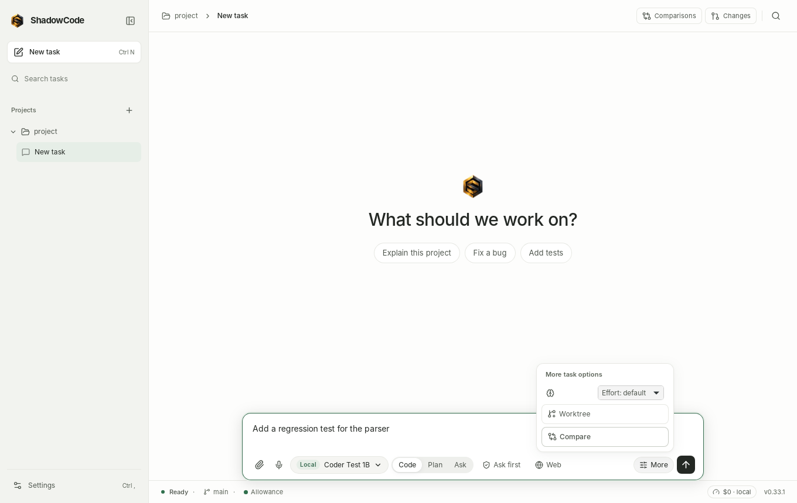

# ShadowCode user guide

This guide describes the 0.34.2 workflow: open a
project, pick a model, describe the task, watch the agent work, then review
what changed. Installation and a feature overview are in the
[README](../README.md).

## Open a project

Use **Open project** (`Ctrl+P`) and choose a folder. The first time, ShadowCode
asks you to trust the folder: project instructions, skills, hooks and plugins
can influence or run work. Tasks do not start in an untrusted project, whether
they come from the desktop, the CLI, goals or MCP.

On first launch, onboarding asks for the project and a permission mode.
*Ask before actions* is the default. You can change it later in
**Settings › Permissions & network**.

If no model is ready yet (no signed-in subscription, no OpenRouter key and no
local model), a second step asks how ShadowCode should think:

- **Download a free model to run on this computer** is preselected when one
  fits. ShadowCode recommends one for your memory and graphics card and shows
  its size and about how long it takes (see
  [free models](LOCAL_MODELS.md#download-a-free-model)). It is free, needs no
  account, and your code stays on the computer. The download starts only when
  you press **Download**; the conversation shows its progress with **Pause**
  and **Cancel**, and selects the model as soon as it is ready. *See other
  free models* opens **Settings › Local models**.
- **Use an OpenRouter key** opens **Settings › Accounts › OpenRouter**
  (paid per use).
- **Sign in to a subscription** opens **Settings › Accounts** (Codex, Claude
  Code, Cursor, Antigravity, Grok).

**Skip for now** leaves the choice for later; the empty conversation offers
the same three choices until a model is ready.

The sidebar groups conversations by project. **New task** (`Ctrl+N`) starts a
new conversation in the current project.

## Edit files and inspect context

Open a file from the project Files list to edit it with code highlighting, line
numbers and undo/redo. Drafts survive switching files and reopening the editor.
Save checks the disk revision so a stale editor does not silently replace a
newer file. Compare asks you to save or discard app-owned unsaved drafts before
it snapshots project files.

Inspect attached context before sending: the inventory shows bounded excerpts,
excluded content, truncation and an approximate token count. These estimates do
not establish the provider's final context size or billed usage.

## Run a check without another model turn

On a completed task summary, choose **Run a check…**, enter the command and
submit it. The command uses the current project and conversation, follows normal
trust and approval controls, and creates its own output and verification
receipt. No model selection is required; the existing composer draft stays
intact. A passing check covers that command and observed snapshot, not every
requirement in the project. See [verification receipts](VERIFICATION_RECEIPTS.md).

## Pick a model

Open the picker (`Ctrl+M`, or the model button in the composer). It has three
groups:

- **Subscriptions / Vendor CLIs**: Codex, Claude Code, Cursor, Antigravity and Grok, run
  through the vendor's official CLI. Unconfirmed billing is labelled Vendor CLIs. See [subscriptions](SUBSCRIPTIONS.md).
- **On this computer**: GGUF models run by the bundled llama.cpp: free
  models downloaded from **Settings › Local models**, files you add, and
  Ollama imports. See [local models](LOCAL_MODELS.md).
- **API keys**: OpenRouter models, billed per token to your OpenRouter
  account. Add a key in **Settings › Accounts › OpenRouter**; until then the
  group offers *Add an OpenRouter API key…*. See [OpenRouter](OPENROUTER.md).

Each row shows Local or Cloud, its availability, a *Vision* or *Chat only*
badge where it applies, and its usage line. Search filters rows. Vendors with
many models show their default, the selected row and recent rows first; the
rest are behind a *Show all* entry. Press the right arrow key or the info icon to
open a row's details: the reason it isn't ready, usage windows and reset times,
and a link to the vendor's own usage page.

A row that isn't ready still opens something useful: *Sign in* opens
**Settings › Accounts**, *Setup required* opens the right settings page, and
*Unavailable* explains why. Send stays disabled until a ready row is selected.

ShadowCode stores the choice for the conversation and uses it as the project's
default for new conversations.

## Describe the task

Type in the composer and press `Enter`. `Shift+Enter` adds a line.

The composer keeps your model, **Code / Plan / Ask**, permission and **Web**
choices in view. Open **More** for reasoning effort, **Compare** and
**Worktree**; press `Escape` or click outside to close it. When an option
can't be used yet (for example before you type a task), the menu says why.
`Ctrl+Shift+Enter` starts a worktree task without opening the menu, and a
non-default reasoning effort stays marked on the **More** button.

- **Attachments.** Attach text files or up to four images per message. Images
  are accepted only when the selected row is marked Vision. Attachments are
  copied into `<project>/.shadow/attachments/`.
- **Web.** The **Web** chip appears when a local or OpenRouter model is
  selected, since vendor CLIs bring their own web tools. Turning it on lets the agent use `web_fetch` and
  `web_search` for the task. In *Web tools off* and *Offline* modes, a pill
  replaces the chip.
- **Permission mode.** The mode control in the composer shows the current mode
  and how the selected vendor applies it.
- **Slash commands.** Type `/` to browse them. `/plan` and `/review` start
  read-only tasks. `/model` opens the picker. Claude Code commands in
  `.claude/commands/` appear here too.
- **Agents.** Start a message with `@explore`, `@plan`, `@review`, `@general`
  or a project agent's name to run that subagent first. Type `@` to list them.
- **Files and folders.** Type `@` anywhere, then part of a path, to pick a
  project file or folder (files your `.gitignore` ignores are left out). The
  pick stays in the message as `@path` and shows as a chip; deleting either
  removes it. Local and OpenRouter models read the file's current contents
  (or the folder's list of files) with the message; vendor CLIs get the
  `@path` and open it themselves.
- **Earlier prompts.** In an empty composer, `↑` brings back the prompts you
  sent in this project, newest first, and `↓` goes forward again.
- **Code, Plan or Ask.** The switch next to the permission control picks the
  mode for the next message. *Plan* and *Ask* are read-only: the agent reads
  the project and answers or writes a plan, and nothing is changed.
  `/plan` and `/review` do the same for one message.
- **Reasoning effort.** Where the chosen model has an effort setting, choose
  *More › Effort*: *default*, *low*, *medium* or *high*, remembered per
  model. It maps to OpenRouter's `reasoning.effort`,
  the thinking switch of local models whose chat template has one (off for
  *low*), Codex's per-turn `effort`, Claude Code's `--effort` and Grok's
  `reasoning_effort` session option. Models without one (Claude Haiku) hide
  the control; Cursor and Antigravity put the effort in their model names
  instead (for example *Gemini 3.8 Flash (Low)*).

If a task is already running, pressing `Enter` queues the message as a
follow-up.

### Your messages

Hover a message you sent for its actions:

- **Edit and resend** opens the text in place. Sending starts a new
  conversation that holds everything before that message, with your edited
  message in its place; the original conversation stays as it was. Tick
  *Also undo the file changes made from this message on* to rewind the files
  that this message's task and every later task changed first.
- **Retry** sends the same message again in this conversation.
- **Copy** copies the text. Answers have **Copy** and **Fork from here**.

## Watch it work

A note above the answer names the model that ran, for example
*Using Cursor · Auto · Cloud*. It appears again only when the model changes.

The activity timeline under the answer is built from recorded events: reading,
searching, editing, running commands, waiting for approval, web sources and
verification. Expand an item to see its output. Vendor tool names (for example
Codex command executions, or Claude's `Bash` and `Edit`) are grouped the same
way as ShadowCode's own tools.

### Approvals

When the agent wants to do something that needs permission, an approval card
shows exactly what it would do. A file change shows its diff against the file
as it is now (the whole content for a new file), the first lines first with
**Show all** for the rest. A command shows the full command and the folder it
runs in. Keyboard shortcuts never approve anything. The card appears in the
conversation as soon as the agent asks.

- **Allow** / **Deny** answer this one request.
- **Allow for this task** also allows the same kind of action until the task
  ends: every file edit, or commands with the same program and subcommand
  (for example all `cargo test …` commands). The card says what it covers.
  Commands that chain (`;`, `&&`, `|`), redirect, use `sudo`, delete files or
  rewrite Git history are never covered and always ask.
- **Deny with note…** sends your reason back to the agent, for example
  *use the Makefile instead*. Local and OpenRouter models and Claude Code
  read the note; Codex, Cursor, Grok and Antigravity only receive the denial,
  so the button isn't shown for them.

- **Local and OpenRouter models.** ShadowCode enforces the permission mode
  for every tool call.
- **Codex, Claude Code, Cursor, Grok.** These vendors send their own approval
  requests, which ShadowCode shows. Each vendor decides which of its actions
  need approval. In Plan/Review tasks, ShadowCode denies vendor requests
  automatically and records a warning.
- **Antigravity.** It asks ShadowCode through its agent server, like Cursor
  and Grok. If it asks you a question instead of for permission, ShadowCode
  can't show the choices yet: it skips the question with a note, and you can
  answer in your next message.

An unanswered vendor approval is denied after 10 minutes
(`cli_agents.approval_timeout_sec`).

### Subagents

With a local or OpenRouter model, the agent can hand focused work to
subagents: `explore` searches, `plan` plans, `review` reviews (all
read-only), and `general` edits files in its own Git worktree. Several can run
at once. Each run shows as a card in the conversation; click it for the
result and changed files, or **Open transcript** for its own conversation.
A write subagent's changes reach your project only when the main agent
applies its diff, with your usual edit approval. Approvals a subagent needs
appear in this conversation, labelled with its name.

Projects can add their own agents in `.shadow/agents/`, `.claude/agents/` or
`.opencode/agent/`, and ShadowCode reads `CLAUDE.md`, nested `AGENTS.md` files,
Cursor rules and Claude Code skills. See [Subagents](SUBAGENTS.md).

### Stop, pause and steer

- **Stop** (`Ctrl+.`) cancels the task. For a vendor CLI, ShadowCode ends the
  vendor's whole process group. A local model stops at the next cancellation
  point.
- **Pause** waits for a safe boundary (a running command finishes first).
  Add a steering note, then **Resume** to continue without replaying finished
  commands. With a vendor CLI, pausing interrupts the vendor's turn and the note
  is sent as a follow-up.

## Review the result

When the task ends, a summary lists the changed files with line counts and any
test or build commands with their results. Ordinary successful commands are
separate from configured or explicitly chosen checks. Use **Refresh check
evidence** to reassess whether passing evidence still matches the current
files. An answer that claims success without a recorded check is marked as
unverified. A task that finished or was stopped without
changing files or running checks shows one quiet line instead, for example
*Finished · 7s · No files were changed.* A stopped task keeps its partial
reply.

- **Run a check…** opens a blank command field, such as `npm test`. It runs
  against the conversation's current project files with your normal command
  approvals, without selecting a model or sending another model request.
  Your unsent message stays in the composer. Output and a new check result
  appear in the conversation; earlier results remain in history. Commands
  have a five-minute maximum, or your shorter configured tool timeout. A
  passing exit code confirms that check, not every requirement of the task.
- **Review changes** appears only when files changed. It opens the task's
  review across the whole window: only the files this task changed, each
  compared with how it was before the task. Switch between a **Unified** and
  a **Split** diff (with code colouring). For each change (hunk) choose
  **Keep** or **Undo**; for a file, **Keep file** or **Undo file**; **Undo
  all** puts back every file you haven't kept. Keep only marks what you have
  looked at; Undo writes the file, and only if it hasn't changed since the
  diff was shown. Undoing asks first in ShadowCode's own dialog. Files a
  vendor CLI reported without a checkpoint are compared with the last
  commit; such a file that isn't in the last commit is never deleted by
  Undo, because ShadowCode can't tell whether the task created it. While a task runs in the project the review is read-only and says
  why. **Back to conversation** returns.
- **Git** (a tab in the review, and the drawer's Changes tab, `Ctrl+Shift+B`)
  shows the whole working tree: compare unstaged and staged hunks, stage a
  hunk or a whole new file, discard a hunk (after confirming), and commit.
  If a file changed since you previewed it, refresh before staging. The
  drawer's tabs keep your work while you switch between them or close the
  drawer: your terminals, the file open in Files and unsent commit and pull
  request drafts stay until you open another project.
- **Rewind** undoes every change the task made to project files. That
  includes ShadowCode's own file tools, files changed by the task's shell
  commands, and files a subscription CLI (Codex, Claude Code, Cursor, Grok,
  Antigravity) changed during the turn. Before each shell command and each
  subscription turn, ShadowCode takes a checkpoint of the project. In a Git
  repository it is a hidden commit under `refs/shadowcode/checkpoints/`; your
  branch, index and staged changes are untouched. In a folder without Git it
  is a copy, for folders up to 5,000 files and 64 MB. A larger folder
  shows *Rewind does not cover this command*. Stop the task first (for a
  subscription, wait for the turn to end). Rewind asks first and lists the
  files that will change. Afterwards a divider marks the conversation
  (*Rewound to here · 2 files restored*) and the notification offers
  **Undo**, which puts the files back as they were just before the rewind
  (if you haven't changed them since). Rewind puts back file permissions a
  command changed (`chmod`). It doesn't restore Git-ignored files, files
  over 4 MB, symlinks, Git history or branches, or anything outside the
  project; a file that was ignored before a step and not after it (the step
  changed `.gitignore`) is listed as not covered and never deleted. It refuses, and changes nothing, if a file was edited
  again after the task. After a rewind (or its undo), the next turn is told
  which files changed on disk. A subscription's own conversation isn't told,
  so mention it in your next message.

## Commit, push and open a pull request

The drawer's **Git** tab (click the branch in the status bar, or
**Commit, push and open a pull request** in `Ctrl+K`) takes the work from
staged changes to a pull request:

- **Branch.** Type a name and **Create branch**, or switch with
  **Switch to…**. Names Git would refuse (spaces, `..`, a leading dash) are
  explained before anything runs.
- **Commit.** **Stage all** (or stage hunks in Changes), then **Suggest
  message**. The draft comes from the conversation's model when ShadowCode
  runs it (a local, API or OpenRouter model), otherwise from the loaded local
  model, otherwise a plain summary of the staged files. It is always an
  editable draft, and files that look like secrets (`.env`, keys) are named
  but never sent to a model.
- **Push** publishes the branch and tracks it, using your own Git sign-in
  (SSH agent, credential helper or `gh auth setup-git`). ShadowCode never
  stores a credential and never force-pushes; if Git would need to ask for a
  password, the push stops and says how to set up sign-in.
- **Pull request.** **Suggest title and description** drafts both the same
  way. Pick the branch to merge into, tick **Draft** if you like, and
  **Create pull request**. The branch is pushed first when needed. This uses
  the GitHub CLI (`gh`) when it is installed and signed in (`glab` for
  GitLab). Without it the tab explains how to install and sign in, and
  **Open compare page in browser** opens the same page on the website.
- After the pull request opens, its link and CI checks appear. Checks refresh
  every minute while the tab is visible, or at once with the refresh button.

Switching branches and committing wait while the agent works; push and pull
requests do not.

## Terminal

The drawer's **Terminal** tab (`` Ctrl+` ``) is your own login shell in the
project folder, with colours, full-screen programs and your usual
environment. **+** opens another; each tab keeps running when you switch tabs
or close the drawer, and all of them close when ShadowCode quits. Terminals
work while the agent runs. They are outside the agent's sandbox, need no
approval, and nothing typed or printed there is shown to a model. The last
512 KB of output is kept for each terminal. Inside a terminal the keyboard
belongs to the shell (`Esc`, `Ctrl+L`, `Ctrl+P` …); `` Ctrl+` `` still
toggles the drawer.

## Preview your app and point at elements

The drawer's **Preview** tab shows your project's dev server inside
ShadowCode. Servers started in this project (from **Tools › Processes**, a
terminal or the agent) are listed under **Servers**; click one or type an
address such as `localhost:5173` and press **Go**. **Back**, **Forward**,
**Reload** and **Open in browser** work as in a browser, and **Phone**,
**Tablet** and **Desktop** lay the page out at those widths. The drawer
widens while Preview is in front.

To show the agent what you mean, press **Pick element** and click something
in the page (the click does not reach the page; `Esc` cancels). It becomes a
chip on the composer, and when you send, the element's address, selector,
text, role, size, key styles and HTML go into the message after your text.
The **Console** strip below the page lists its errors and warnings; **Attach**
adds one to your next message, **Attach all** adds them together. Remove a
chip with ×. Only servers on this computer (`localhost`, `*.localhost`,
`127.0.0.1`) open. Details and the security model are in
[PREVIEW.md](PREVIEW.md).

## Tools while you work

The drawer's **Tools** tab holds what you use during work rather than
configure: **Goals** (milestone checklists), **Automations** (prompts that
run on a schedule), **Issues** (start a task from a GitHub or GitLab issue),
**Processes** (dev servers and watchers that keep running between tasks) and
**Worktrees**. `Ctrl+K` (*Goals and milestones*, *Automations*, *Start from
an issue*, *Background processes*, *Worktrees*) and the `/goals` and
`/background` commands open them there.

- **Automations** run a saved prompt hourly, daily, on weekdays, weekly or
  on a cron schedule while ShadowCode (or `shadowcode serve`) is open. Each
  run is its own conversation, by default in a fresh worktree, stops when it
  asks for approval unless you let it wait, and has a time limit. Missed
  times are caught up once at startup within a window you choose, otherwise
  recorded as missed. The history shows each run's result, duration and
  cost.
- **Issues** lists open issues through `gh` or `glab`, fills the message box
  with the picked issue (title, description, newest comments) for you to
  review, creates an `issue-<n>-…` branch, and when the task finishes offers
  **Open PR that closes #n** in the Git tab.

See [Automations, issues and the GitHub Action](AUTOMATIONS.md) for the
details, including running ShadowCode from GitHub Actions.

Skills, MCP, plugins, hooks, Guardian, vendor tools and health stay in
**Settings › Advanced**.

In **Settings › Permissions & network**, how each runner applies the mode
(ShadowCode's own tools, and each subscription) is folded under
*How … applies this*.

## Switch models mid-conversation

You can pick another row at any time. If a task is running, it keeps its model
and the new choice applies from the next turn.

- **Same vendor, different model.** The vendor's session resumes with the new
  model, and a *model switched* note appears. No handoff is needed.
- **Different provider.** The new provider hasn't seen the earlier turns, so
  ShadowCode passes it a handoff block: your requests, the final answers and
  the changed files, up to 12,000 characters, marked as earlier context and not
  as instructions. Vendor CLIs receive it before your message. Local and
  OpenRouter models read the same turns from the conversation history.
- **Consent.** Before content goes to a cloud provider, a dialog shows what
  would be sent. This happens when the previous turn ran on this computer, when
  the conversation moves to another provider, or when you first attach images
  to a cloud row in this conversation. Nothing is sent or recorded until you
  choose **Send**. **Cancel** leaves the conversation unchanged.

When you return to a vendor you used earlier in the conversation, ShadowCode
resumes that vendor's own session: Codex `thread/resume`, Claude `--resume`,
Cursor, Grok and Antigravity ACP `session/load`.

## When a plan limit is reached

If a vendor reports that your plan limit is reached, the task stops with the
status *Plan limit reached*, and that vendor's affected rows show as
unavailable until the limit resets. ShadowCode doesn't retry on the same plan,
buy credits or turn on overages.

What happens next is set under **When a plan runs out**, in the Allowance
panel and at the top of **Settings › Accounts**:

- **Continue on a local model** (the default). The same conversation carries
  on right away on a model on this computer, with the usual summary of the
  earlier turns. The conversation shows "Codex reached its plan limit.
  Continuing on qwen3:14b on this computer." and the follow-up message is
  labelled *Continued automatically*. Nothing leaves your computer and there is
  no quota. The model is the one you pick in the setting, or else the last
  local model you used in this project, or else the first ready local model
  with tool support. A Compare lane never continues on another model: it
  stops at *Plan limit reached*, so its result stays that model's own.
- **Ask me.** The conversation shows a card with **Continue on <local model>**
  and **Choose another model**.

If no local model is ready, the conversation says so and offers **Open Local
models**.

## Allowance

The **Allowance** button in the status bar opens one list of everything you
can run and how much of it is left, as each source reports it:

- **Subscriptions**: the reported usage windows with reset times (Codex;
  Claude Code after its first task), the plan, *Plan limit reached*, or
  *Usage not reported* for vendors that expose none. Signed-out or missing
  tools link to **Settings › Accounts**.
- **OpenRouter**: credits left of your key's limit or of your account
  balance, whichever is smaller, *Out of credits*, or what has been spent.
- **On this computer**: how many local models are ready. There is no quota,
  and the **When a plan runs out** setting lives here.

The dot on the button turns amber when a source you can run is low or has
reached its limit. **Refresh** checks the vendor accounts again.

## Compare models

Not sure which model suits a task? Type it, open **More › Compare**, and
choose 2 or 3 models (at most one on this computer). Each works
in its own copy of the project, starting from your latest commit plus any
uncommitted work, so your files stay as they are until you choose.

The **Comparisons** view (top bar, or *Comparisons in this project* in the
command palette) shows every lane side by side: what it changed, which checks
passed, how long it took and what it used. Open a file to see that lane's
change, or open its conversation to follow up with that model. A lane that
asks for permission says so, and approvals work as usual.

- **Keep** applies that model's changes to your project's working tree. Review
  them in **Changes** as usual; nothing is committed. If your project changed
  since the comparison started and the changes no longer apply, ShadowCode
  lists the conflicting files and changes nothing.
- **Discard all** throws every lane away. **Stop** cancels lanes that are
  still working and keeps what they did so far.

After keep or discard, every lane's copy and branch is removed. **Wins in this
project** counts which model you kept. Every lane is a full task: subscription
lanes use your plan, OpenRouter lanes are billed per token. Details:
[compare](COMPARE.md).

## Run tasks side by side

A project runs one task at a time in its folder. To start another while one
is working, type it and choose **More › Worktree** (or press
`Ctrl+Shift+Enter`). While a task is running, the menu item reads **Run now in
worktree** instead of queueing.

The new task gets its own conversation and its own copy of the project,
starting from your latest commit plus any uncommitted work (your files are
not touched). It is listed under the project with a branch icon, and a bar
above the composer shows what it changed. When it is done:

- **Apply to project** checks that its changes still fit your project, then
  writes them to your files (nothing is committed; review them in
  **Changes**). If files it changed were also changed in the project since,
  nothing is written and those files are listed.
- **Keep as branch** saves the result as a commit on branch
  `shadowcode/<id>` for you to merge later.
- **Discard** throws the result away.

Either way the copy is removed and the conversation continues in the
project. A conversation with its own copy can't be deleted until you apply,
keep or discard it.

## Conversations in the sidebar

- **Badges**: a pulsing dot while a task runs, a clock while it is queued, a
  hand when it **needs your approval**, a warning sign when it **failed**, and
  a dot when it **finished** while you were elsewhere (until you open it).
- **Right-click** a conversation (or press the menu key) to **Rename**,
  **Pin**, **Fork**, **Export** or **Delete** it. Deleting a conversation
  also deletes its subagents' conversations, unless a fork of it still
  shows them.
- A narrow window hides the sidebar; it comes back when the window is wide
  again, unless you closed it yourself (`Ctrl+B`).
- `Alt+↑` / `Alt+↓` open the previous or next conversation in the list;
  `Ctrl+Tab` goes back to the one you had open before.

## Notifications

When the window is in the background, or the task is in another
conversation, ShadowCode notifies you when a task needs approval, fails,
reaches a plan limit (saying whether it continued on a model on this
computer) or finishes. An unanswered approval is denied after 10 minutes; you
are warned 2 minutes before. Click a notification to open its conversation.
Choose which ones you get, and whether they play a sound, in **Settings ›
Appearance**.

To get them on your phone too, set up ntfy in **Settings › Remote access ›
Phone notifications** (see below).

## Use it from your phone

**Settings › Remote access** lets a phone or another computer follow and
steer ShadowCode in a web browser: watch tasks stream, answer approvals, send
messages and review changes. It is off until you turn it on, and only
devices you pair can connect.

1. Turn on **Turn on remote access**. It starts on *This computer only*.
2. To reach it from a phone, use Tailscale: run `tailscale serve --bg 7390`
   and enter the HTTPS address it prints as **Public address**, or choose
   your Tailscale address under **Where it listens**. A local network address
   also works, but plain HTTP on a local network is not encrypted.
3. Choose **Pair a device** and scan the QR code with the phone (the link
   works once, for 10 minutes). Add it to the home screen to open it like an
   app.

Terminals are off for paired devices unless you turn on **Allow terminals
over remote access**. Secret files and keys are never shown remotely.
**Unpair** a device (or all of them) at any time. **Phone notifications**
send "needs approval", "finished", "failed" and "plan limit" messages
through [ntfy](https://ntfy.sh) to your phone, with a link back to the
conversation; nothing is sent until you enter a server and topic. Without a
window, `shadowcode serve --remote` does the same. Details:
[REMOTE.md](REMOTE.md).

## Context and cost

The chip at the bottom right shows the open conversation's context use and
cost, for example `42% · 38k / 128k · $0.12`. For subscription CLIs it shows
the tokens and cost the tool reported (no percentage; the tool manages its
own context), marked *reported by …*. `est.` means the cost was worked out
from the model's prices; models on this computer show `$0 · local`. Click it
for input, output and cached tokens, cost, model requests and the last
compaction.

## Code intelligence

With a local or OpenRouter model, ShadowCode helps the agent understand the
project (**Settings › Code intelligence**):

- **Errors after each edit.** If a language server is installed for the file
  (rust-analyzer, typescript-language-server, pyright, gopls or clangd), the
  agent is told about errors its edit introduced, not ones that were already
  there. Servers run without building or running project code. The TypeScript
  and Python servers can be installed from Settings with one click (about
  25 MB and 19 MB); nothing downloads on its own.
- **A map of the code.** Each task starts with a short, ranked outline of the
  project's main definitions, favoring files you name and files the agent
  recently edited. Choose its size, or turn it off, in Settings.
- **Code search.** The agent can search code by keywords. Install a small
  embedding model (35 MB or 139 MB) in Settings to also search by meaning.

Details: [code intelligence](CODE_INTELLIGENCE.md).

## Voice input

Dictate instead of typing: **hold** the microphone button next to Attach (or
**Ctrl+Shift+Space**) while you talk and let go, or click it once to start and
again to stop. The words go in where the cursor is; nothing is sent until you
press Send. While it listens, the button shows a level meter and a pill above
it shows the time and, with a local model, the words so far. **Esc** or **×**
throws the recording away, and **Undo** removes what was just inserted. Say
"new line" or "new paragraph" to break lines.

The first time, the button opens **Settings › Voice**: install a model
(Whisper base English, 141 MB, is recommended; tiny is 74 MB; a multilingual
base model is 141 MB). Transcription then runs on this computer and the audio
never leaves it. If you have an OpenRouter key you can choose **OpenRouter**
instead (each recording is uploaded and billed, about $0.001 per minute). It
records from your system's default microphone. Details:
[voice input](VOICE.md).

## Offline and web-off

In **Settings › Permissions & network**:

- **Web tools off**: ShadowCode's own agent loop (local and OpenRouter models)
  gets no web tools. Subscriptions still work.
- **Offline**: only rows under *On this computer* run. Cloud rows show as
  unavailable. ShadowCode starts no vendor process for sign-in status, models
  or usage, and a cloud job is refused with
  "Offline mode: choose a model that runs on this computer". Shell commands
  that reach the network (for example `curl`, `npm` or `pip`) are denied.
  Voice input keeps working with a local model; OpenRouter transcription and
  model downloads (chat, voice and code-search models) are refused. A free
  model that is downloading stops and can be resumed once you are online. The
  daily update check pauses too.

## About and updates

**Settings › About** shows the version, the commit it was built from, how it
was installed (AppImage, Debian package, another system package, or built from
source), the license (Apache 2.0, with the NOTICE that credits Shadowfetch as
the original creator) and links to the release notes, source, license, this
guide and the issue tracker.

Once a day while the window is open, ShadowCode asks GitHub which release is
the newest. The request sends no version, account or other identifier, and
ShadowCode never downloads or installs anything by itself. When a newer
version exists:

- **Update available: VERSION** appears at the right of the status bar. Click
  it to open Settings › About.
- About shows the new version, its release notes and the steps for your
  installation: for the AppImage, download it with its four signature files
  and run the authenticated installer (copy the command with the copy
  button); for the deb, update through your package manager.
- **Hide the notice until the next version** removes the status-bar button
  until a newer release appears.

**Check now** asks right away. **Check for updates once a day** turns the
daily check off. In Offline mode nothing is checked. If your distribution
manages ShadowCode's updates, About says so instead and the switch is not
shown. A check that fails (for example with no network) stays quiet; About
shows why the last one didn't work.

## Your data: back up, restore, repair, start over

**Settings › Your data** backs up your conversations, tasks, goals,
automations and settings to a private folder (API keys only if you tick the
box), restores a backup after checking it, checks and repairs the database,
and resets ShadowCode by moving everything aside, never deleting it. Restores
and resets happen the next time ShadowCode starts. It also lists the copies
made automatically before each upgrade. The same is on the command line:
`shadowcode backup`, `shadowcode restore FOLDER`, `shadowcode doctor --repair`
and `shadowcode reset`. See [Your data](DATA.md) for the details.

## The shell sandbox

ShadowCode runs shell commands from local and OpenRouter models in a sandbox
when [bubblewrap](https://github.com/containers/bubblewrap) is installed
(`sudo apt install bubblewrap`). Inside it:

- Your **home folder is empty**. Only toolchain folders (`~/.cargo`,
  `~/.rustup`, `~/.nvm`, `~/.npm`, `~/.cache/pip`, `~/.local/bin`,
  `~/.gitconfig`, `~/.pyenv`, `~/.bun`, `~/.deno`) are visible, and they are
  read-only. SSH keys, cloud credentials, `~/.config` (including ShadowCode's
  API keys) and `~/.local/share` are never visible. To change the list, edit
  `sandbox.home_binds` in `~/.config/shadow-agent/config.yaml`. Credential
  folders are refused there.
- **Only the project is writable.** Files written elsewhere in the home
  folder vanish when the command ends.
- **Network**, under **Shell commands** in **Settings › Permissions &
  network**: *No network*, *Full network*, or *Only allowed hosts*. With
  *Only allowed hosts*, list one host per line (`crates.io`,
  `*.githubusercontent.com`, `localhost:3000`). Web requests from tools that
  use the standard proxy variables (curl, pip, npm, cargo, git) reach only
  those hosts. Anything else, including direct connections and DNS, fails.
  A blocked request gets `403` with the host named. The tool result lists
  what was reached and blocked.

The **Shell commands** section says which sandbox this computer provides.
Without bubblewrap, commands run under Landlock file limits when the kernel
supports them, and the conversation shows a warning once. Turn on **Require
sandbox** to refuse shell commands instead. *Only allowed hosts* always needs
bubblewrap: without it, commands are refused rather than run unfiltered.
Subscription CLIs use their own sandboxes, not this one.

## Continue, organize and recover

- **Reloading** the window keeps the selected conversation, the transcript and
  your unsent draft. A running task reconnects without repeating output.
- **Older messages** pages back through long conversations. **Fork from here**
  starts a new conversation at a response. A very long page shows its latest
  150 items first; **Show … earlier items** adds more without moving what
  you are reading.
- **Interrupted tasks.** If ShadowCode exits during a task, the task is marked
  *interrupted*. **Continue task** writes a recovery request for you. Shell
  commands and file edits are never replayed automatically.
- **Tasks** in the drawer (or *Manage tasks* in the `Ctrl+K` command palette)
  lists every conversation with search, **Rename**, **Fork**, **Export**
  (`Ctrl+Shift+E` exports the open one) and **Delete**, which asks first.

## Long conversations, retries and cost

- **Long conversations.** When a conversation no longer fits the model's
  context, ShadowCode removes the oldest steps (a tool call always goes with
  its result) and asks the same model for a short summary of what was
  removed: goals, decisions, files, commands and open problems. The summary
  stays in the conversation, so later messages start from it. For models with
  less than 8K of context, or when the summary fails or takes longer than a
  minute, a built-in digest is used instead. The full history always stays in
  the app. Turn summaries off with `agent.summary_compaction: false`.
- **Busy or dropped providers.** A request that fails with a rate limit, an
  overloaded or failing provider, or a connection that drops mid-answer is
  sent again, up to three times (`agent.model_retries`), waiting longer each
  time or as long as the provider asks. A reply that was cut off is thrown
  away and replaced; tools only run after a complete reply, so nothing runs
  twice. Errors such as a wrong key or an unknown model are shown at once.
- **Tokens and cost.** Every job and conversation records input, output and
  cached tokens and a cost in US dollars: what OpenRouter charged, zero for a
  model on this computer, and what a subscription CLI reports (Claude Code
  reports a cost, Codex reports tokens). When OpenRouter doesn't report a
  cost, ShadowCode works it out from the model's listed prices and marks it
  as an estimate. Type `/cost` to see the conversation's totals.
- **Prompt caching.** Claude and Gemini models on OpenRouter are asked to
  cache the unchanging start of each request, which makes later steps
  cheaper and faster. Other providers cache on their own.

## Troubleshooting

- **The status bar says Not connected.** The window could not reach
  ShadowCode's engine when it opened. Choose **Reconnect** in the message at
  the top of the conversation. A Settings page that could not load shows the
  reason and **Try again**.
- **A subscription row says Sign in.** Use **Settings › Accounts › Connect**,
  or run the vendor's login command in a terminal and choose **Refresh**.
  Antigravity's sign-in is ShadowCode's own, so use **Connect** for it.
- **Antigravity says Setup required.** Choose **Install** on its Accounts card
  (a one-time 334 MB download from Google), then **Connect**.
- **A local row says Setup required.** The llama.cpp runtime is missing. Run
  `scripts/install-appimage.sh` again, or build it with
  `scripts/build-llama.cpp.sh`.
- **A local model loaded on the CPU.** The row shows *CPU fallback (GPU load
  failed)*. Check that `libvulkan1` and a Vulkan driver are installed, and read
  the error on **Settings › Local models**.
- **A model download stopped.** The partial file is kept: choose **Resume**
  on its row (the conversation or **Settings › Local models**) and it
  continues where it stopped, even after ShadowCode restarts. *Not enough disk
  space* names the folder and how much is needed. A file that fails its
  checksum is deleted; download it again.
- **The AppImage won't mount.** Run it with `--appimage-extract-and-run`. FUSE
  is optional.
- **A command fails with "Require sandbox is on".** Install bubblewrap, or turn
  off **Require sandbox**. If bubblewrap is installed but still reported
  unavailable, your system may block unprivileged user namespaces. Ubuntu
  24.04 ships an AppArmor profile that allows them for `bwrap`.
- **A command can't find a tool from your home folder.** Add its folder to
  `sandbox.home_binds`, for example `go` or `.sdkman`.
- **You need stronger isolation.** Use a container or a separate Linux account.
  Shell commands run with your user's privileges, and the sandbox limits what
  they can see, not what that user may do.

Settings and history live in `~/.config/shadow-agent` and
`~/.local/state/shadow-agent`. Back up both before moving to another machine.
